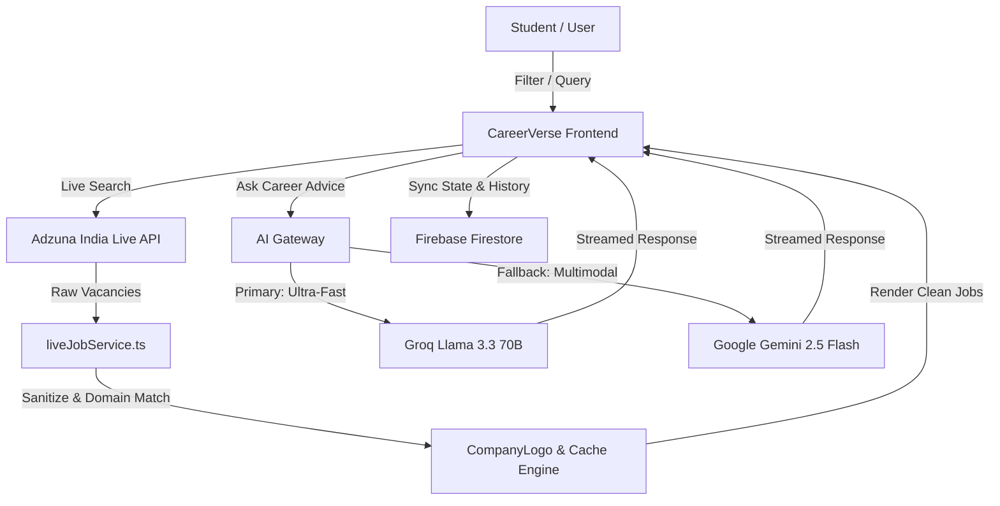

# 🎓 CareerVerse AI — Next-Generation Indian Career Intelligence & Live Job Radar

[](https://react.dev/)
[](https://tailwindcss.com/)
[](https://firebase.google.com/)
[](https://groq.com/)
[](https://developer.adzuna.com/)
[](LICENSE)

**CareerVerse AI** is an end-to-end, hyper-personalized career navigation, skill acceleration, and live employment ecosystem designed specifically for the **Indian education system and modern workforce**. 

From navigating **10th & 12th (PUC/Intermediate)** stream selection and **Degree/Engineering** roadmaps to **AI-evaluated aptitude assessments**, **ATS resume benchmarking**, and a **100% real-time Live Indian Job Radar**, CareerVerse AI guides students and professionals at every milestone of their journey.

---

## 📑 Table of Contents
1. [Platform Architecture: The 9 Career Stations](#-platform-architecture-the-9-career-stations)
2. [Deep Dive into Core Capabilities](#-deep-dive-into-core-capabilities)
3. [Technology Stack](#-technology-stack)
4. [Project Directory Structure](#-project-directory-structure)
5. [AI Multi-Model Engine & Live Data Pipeline](#-ai-multi-model-engine--live-data-pipeline)
6. [Environment Variables & Configuration](#-environment-variables--configuration)
7. [Installation & Setup Guide](#-installation--setup-guide)
8. [Performance, Caching & Resilience](#-performance-caching--resilience)
9. [Roadmap & Future Enhancements](#-roadmap--future-enhancements)
10. [License](#-license)

---

## 🚉 Platform Architecture: The 9 Career Stations

CareerVerse AI organizes the entire Indian career development lifecycle into 9 synchronized, interconnected stations:

```
┌─────────────────────────────────────────────────────────────────────────────┐
│                            CAREERVERSE AI HUB                               │
└──────────────────────────────────────┬──────────────────────────────────────┘
                                       │
      ┌────────────────────────────────┼────────────────────────────────┐
      │                                │                                │
┌─────▼──────────────┐       ┌─────────▼──────────┐       ┌─────────────▼──────┐
│  STATION 01 · RADAR│       │  STATION 02 · ROUTE│       │  STATION 03 · PATHS│
│  Compass & Profile │       │  10th & 12th/PUC   │       │  Degrees & Colleges│
└─────┬──────────────┘       └─────────┬──────────┘       └─────────────┬──────┘
      │                                │                                │
┌─────▼──────────────┐       ┌─────────▼──────────┐       ┌─────────────▼──────┐
│  STATION 04 · MAPS │       │  STATION 05 · ROLES│       │  STATION 06 · GAPS │
│  Dynamic Roadmaps  │       │  Role Explorer & ₹ │       │  Skill Gap & ATS   │
└─────┬──────────────┘       └─────────┬──────────┘       └─────────────┬──────┘
      │                                │                                │
┌─────▼──────────────┐       ┌─────────▼──────────┐       ┌─────────────▼──────┐
│  STATION 07 · EXAM │       │  STATION 08 · BOT  │       │  STATION 09 · RADAR│
│  AI Aptitude Test  │       │  24/7 AI Counselor │       │  Live Jobs Portal  │
└────────────────────┘       └────────────────────┘       └────────────────────┘
```

| Station # | Station Name | Target Milestone & Purpose |
| :--- | :--- | :--- |
| **01** | **Compass Dashboard** | User stage identification (`School`, `PUC/12th`, `Degree`, `Placement`), daily progress tracking, and personalized career recommendations. |
| **02** | **Indian Education Route** | Stream decision engine for Class 10/12 (Science MPC/BiPC, Commerce, Arts, Polytechnic, Vocational, and ITI diplomas). |
| **03** | **College & Degree Navigator** | Entrance exam roadmaps (JEE, NEET, CUET, KCET, GATE, CAT) and degree pathways (B.Tech, B.Sc, BCA, B.Com, BBA, Design, Law). |
| **04** | **AI Dynamic Roadmaps** | 3–4 year semester-wise milestones, required tech stacks, open-source projects, and recognized certifications. |
| **05** | **Role Explorer & Market Salaries** | Deep-dive profiles into 20+ top careers (AI Engineer, Full Stack Developer, Cloud Architect, Data Analyst, Product Manager, etc.) with LPA salary benchmarks. |
| **06** | **Skill Gap Analyzer & ATS** | Direct comparison between a user's skills and target job specs, calculating % readiness score and step-by-step missing skill plans. |
| **07** | **AI Aptitude & Technical Assessment** | Adaptive multiple-choice assessments evaluating reasoning, coding aptitude, and domain logic with AI scorecards. |
| **08** | **24/7 AI Career Counselor** | Ultra-fast conversational guidance powered by Groq Llama 3.3 70B & Gemini with persistent Firebase chat history. |
| **09** | **Live Indian Job Radar** | 100% live job search powered by the Adzuna India API across top hiring hubs (Bengaluru, Hyderabad, Pune, Mumbai, Delhi NCR, Chennai, Remote) with logo resolution and internship lock. |

---

## 🔍 Deep Dive into Core Capabilities

### 1. 💼 Station 09 · Real-Time Live Job Radar (Adzuna India Integration)
- **100% Real Vacancy Feed:** Pulls direct openings from Adzuna's Indian recruiter network (no mock datasets).
- **Major Indian Tech Hubs:** Dedicated 1-click filtering for Bengaluru (`Bangalore`), Hyderabad, Pune, Mumbai, Delhi NCR (`Delhi`), Chennai, and Remote India.
- **Smart Internship Mode:** Automatically sets experience level to `Fresher / Student (Internship)`, locks senior filters, and prioritizes verified internship and trainee postings.
- **Fresher Opportunity Boosting:** Targets entry-level, graduate engineering trainee (GET), and associate engineer roles so fresh graduates discover hundreds of openings.
- **Enterprise Logo Engine:** Real-time domain resolution for top Indian and global recruiters (TCS, Infosys, Swiggy, Zepto, Flipkart, L&T, Birlasoft, Crum & Forster, Google, Amazon, Deloitte, etc.) with vibrant monogram fallbacks.
- **Zero-Lag In-Memory Caching:** 3-minute LRU memory cache for lightning-fast tab switching across cities and job types.
- **Accurate Count Synchronization:** Live vacancy count badge updates in sync with applied filters and active job listings.

### 2. 🤖 Station 08 · AI Career Counselor
- **High-Velocity LLM Inference:** Powered by **Groq Llama-3.3-70b-versatile** and **Google Gemini 2.5 Flash**.
- **Context-Aware Memory:** Incorporates the student's current academic stage, target career, and assessment results into conversation context.
- **Firestore Persistence:** Chat logs and guidance threads persist securely across sessions.

### 3. 🎯 Station 06 & 07 · Assessment & Skill Gap Engine
- **Automated Match Analysis:** Highlights essential vs. secondary skills for any target role.
- **Actionable Gap Remediation:** Generates custom reading lists, GitHub project ideas, and certification roadmaps to bridge candidate deficiencies.
- **AI Diagnostics:** Provides deep rationale for correct/incorrect answers during aptitude exams.

---

## 🛠️ Technology Stack

| Layer | Technologies | Description |
| :--- | :--- | :--- |
| **Frontend Framework** | React 19, TypeScript 5.7, Vite 6 | High-performance SPA with strict typing and lightning-fast HMR. |
| **Styling & Design System** | Tailwind CSS v4, Lucide Icons, Custom Scrollbars | Custom dark & glassmorphism themes with responsive typography. |
| **AI & Inference Engines** | Groq Cloud (Llama 3.3 70B), Google Gemini 2.5 Flash | Multi-model fallback for conversational counseling and role generation. |
| **Authentication & Database** | Firebase v12 (Auth + Cloud Firestore) | Real-time user sync, persistent career profiles, and chat memory. |
| **Live Employment API** | Adzuna Developer API (India Region `in`) | Real-time recruiter vacancy stream, salary ranges, and direct application links. |
| **Deployment / Runtime** | Node.js v18+, Vercel / Netlify ready | Production bundle optimized with Rolldown / Vite build pipeline. |

---

## 📂 Project Directory Structure

```
final_Career/
├── frontend/
│   ├── src/
│   │   ├── components/
│   │   │   ├── chatbot/          # AI Counselor chat interfaces
│   │   │   ├── layout/           # Navbar, Sidebar (Stations 01-09), Footer
│   │   │   └── ui/               # Reusable UI components (Buttons, Modals, Cards)
│   │   ├── data/                 # Indian education curriculum, entrance exam maps
│   │   ├── hooks/                # Auth and session state hooks (useAuth)
│   │   ├── pages/
│   │   │   ├── assistant/        # Dashboard, AI Counselor, Profile pages
│   │   │   ├── auth/             # Login, Signup, Password Reset
│   │   │   ├── career/           # LiveJobsPage (Station 09), Roadmap, Assessment, Explorer
│   │   │   └── education/        # 10th/12th Routes, Degree Navigator
│   │   ├── services/
│   │   │   ├── firebase.ts       # Firebase v12 Auth and Firestore client
│   │   │   ├── groqService.ts    # Groq Llama 3.3 inference wrapper
│   │   │   ├── geminiService.ts  # Google Gemini 2.5 generative AI wrapper
│   │   │   ├── liveJobService.ts # Adzuna Live API engine, caching, company logos
│   │   │   └── roleExplorerAI.ts # Dynamic career role generation service
│   │   ├── App.tsx               # Main routing & application layout
│   │   ├── index.css             # Tailwind v4 directives, custom scrollbars
│   │   └── main.tsx              # React DOM bootstrap
│   ├── .env                      # Environment credentials (API Keys)
│   ├── package.json              # Dependencies and scripts
│   └── vite.config.ts            # Vite build configuration
├── backend/
│   ├── server.js                 # Optional Node.js proxy server
│   └── package.json              # Backend dependencies
└── README.md                     # Complete project documentation
```

---

## ⚡ AI Multi-Model Engine & Live Data Pipeline



---

## 🔐 Environment Variables & Configuration

Create or update `frontend/.env` with your API credentials:

```env
# Firebase Authentication & Firestore
VITE_FIREBASE_API_KEY=your_firebase_api_key
VITE_FIREBASE_AUTH_DOMAIN=your_project.firebaseapp.com
VITE_FIREBASE_PROJECT_ID=your_project_id
VITE_FIREBASE_STORAGE_BUCKET=your_project.firebasestorage.app
VITE_FIREBASE_MESSAGING_SENDER_ID=your_sender_id
VITE_FIREBASE_APP_ID=your_app_id

# AI Providers (Groq & Gemini)
VITE_GROQ_API_KEY=your_groq_api_key
VITE_GEMINI_API_KEY=your_gemini_api_key
VITE_GEMINI_MODEL=gemini-2.5-flash

# Adzuna Developer API (Live Jobs Portal)
VITE_ADZUNA_APP_ID=your_adzuna_app_id
VITE_ADZUNA_APP_KEY=your_adzuna_app_key
```

> **Note:** To obtain Adzuna Developer API credentials, register for a free account at [Adzuna Developer Portal](https://developer.adzuna.com/).

---

## 🚀 Installation & Setup Guide

### 1. Prerequisites
- [Node.js](https://nodejs.org/) (version `18.x` or higher recommended)
- [npm](https://www.npmjs.com/) or [yarn](https://yarnpkg.com/)
- Modern web browser (Chrome, Edge, Firefox, Brave, Safari)

### 2. Clone the Repository
```bash
git clone https://github.com/your-username/CareerVerse_AI.git
cd CareerVerse_AI
```

### 3. Setup and Run the Frontend
```bash
cd frontend
npm install
npm run dev
```

The application will be accessible at:
```
http://localhost:5173
```

### 4. Build for Production
To validate TypeScript types and generate the optimized production bundle:
```bash
npm run build
```

---

## 🛡️ Performance, Caching & Resilience

1. **In-Memory Query Cache:**
   - Caches search queries and city combinations for 3 minutes.
   - Prevents redundant HTTP requests and ensures **instantaneous tab switching**.
2. **Special Character Sanitization:**
   - Cleans search inputs (e.g. `Cloud / DevOps` ➔ `Cloud DevOps`, `FinTech & Banking` ➔ `FinTech Banking`) to prevent Lucene search syntax syntax errors.
3. **Query Fallback Relaxation:**
   - If a restrictive search combination returns 0 results from upstream feeds, the service automatically relaxes specific modifiers to guarantee relevant role suggestions.
4. **Adzuna Rate-Limiting Protection:**
   - Requests are batched on demand with debounced user interactions to prevent HTTP 429 rate limit exceptions.

---

## 🗺️ Roadmap & Future Enhancements

- [x] **Station 09 Live Jobs:** Integrated live Adzuna India API with tech hub filters and company logo resolution.
- [x] **Smart Internship Filter:** Auto-lock to fresher experience for student/internship searches.
- [x] **In-Memory Cache:** Zero-lag tab and city switching.
- [ ] **WhatsApp Career Alerts:** Automated notifications for newly posted internships matching user target skills.
- [ ] **AI Mock Interview Studio:** Speech-to-text technical and HR mock interviews with real-time feedback.
- [ ] **College Placement Cell Portal:** Dedicated dashboard for college TPOs to track student readiness.

---

## 📄 License

This project is licensed under the **MIT License** — see the [LICENSE](LICENSE) file for details.

---

*Built with ❤️ for Indian Students & Aspiring Tech Professionals by CareerVerse AI.*
