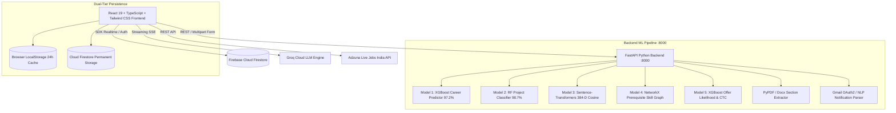

# 🚀 CareerVerse AI — Master Engineering & System Architecture Documentation

> **Next-Generation AI & ML-Powered Career Wayfinding & Intelligence Platform for Indian Engineering and Higher Education Pathways**

[](https://fastapi.tiangolo.com)
[](https://react.dev)
[](https://www.typescriptlang.org)
[](https://xgboost.readthedocs.io)
[](https://huggingface.co/sentence-transformers/all-MiniLM-L6-v2)
[](https://networkx.org)
[](https://firebase.google.com)
[](https://groq.com)

---

## 📌 Executive Summary

**CareerVerse AI** is an end-to-end, multi-tier career intelligence and wayfinding ecosystem built specifically for students, graduates, and professionals navigating the Indian higher education-to-industry transition. Unlike traditional static resume builders or generic job portals, CareerVerse AI integrates:

1. **5 Local Machine Learning Engines**: Custom-trained XGBoost classifiers, Random Forest project maturity evaluators, dense 384-D sentence embeddings, NetworkX topological prerequisite DAG engines, and XGBoost offer likelihood & CTC predictors.
2. **Adaptive Psychometric & Aptitude Diagnostics**: 3-stage adaptive evaluation with automated tie-breaker algorithms to resolve cross-domain ambiguities.
3. **Multi-Horizon Adaptive Roadmap Studio**: Granular week-by-week/month-by-month curricula (1 Month Blitz, 3 Months Sprint, 6 Months, 1 Year, 2 Years) featuring deep subtopic checklists, micro-projects, technical interview questions, and role-specific placement accelerators.
4. **Real-Time Market Velocity Radars**: 24-hour cached employer requisition metrics across 27 technical disciplines in India's top tech hubs.
5. **Unified Application Tracker & Inbox Scanner**: Automated parsing of notification emails from Naukri, Internshala, LinkedIn, and Indeed into a 4-stage recruitment conversion funnel with proactive AI follow-up and interview preparation prompts.
6. **24/7 AI Career Counselor**: Streaming counseling running on Groq Cloud LPU (sub-50ms TTFT) backed by permanent Firestore cloud transit logs.

---

## 📑 Table of Contents

1. [System Architecture](#-system-architecture)
2. [Complete Technology Stack & Component Justifications](#-complete-technology-stack--component-justifications)
3. [Machine Learning & NLP Deep-Dive (5 Local Engines + Cloud Streaming)](#-machine-learning--nlp-deep-dive-5-local-engines--cloud-streaming)
   - [Model 1: XGBoost Multi-Role Career Recommendation Engine (97.2% Accuracy)](#model-1-xgboost-multi-role-career-recommendation-engine-972-accuracy)
   - [Model 2: Project Complexity & Engineering Maturity Classifier (98.7% CV Accuracy)](#model-2-project-complexity--engineering-maturity-classifier-987-cv-accuracy)
   - [Model 3: Sentence-Transformers Resume-JD Semantic Embedding Engine (Dense 384-D Latent Matcher)](#model-3-sentence-transformers-resume-jd-semantic-embedding-engine-dense-384-d-latent-matcher)
   - [Model 4: Prerequisite Skill Graph Engine (NetworkX DAG Topological Sorter)](#model-4-prerequisite-skill-graph-engine-networkx-dag-topological-sorter)
   - [Model 5: XGBoost Placement Offer Likelihood & CTC Predictor (Calibrated on 10k Student Velocity & 200k Tech Jobs)](#model-5-xgboost-placement-offer-likelihood--ctc-predictor-calibrated-on-10k-student-velocity--200k-tech-jobs)
   - [Model 6: Groq Cloud LPU & Gemini LLM Streaming Counselor (Sub-50ms TTFT)](#model-6-groq-cloud-lpu--gemini-llm-streaming-counselor-sub-50ms-ttft)
4. [The 10 Waypoint Stations: Deep Mathematical & Operational Mechanics](#-the-10-waypoint-stations-deep-mathematical--operational-mechanics)
   - [Station 01: Centralized Wayfinding Command & Dashboard (`/dashboard`)](#station-01-centralized-wayfinding-command--dashboard-dashboard)
   - [Station 02: Career Navigator & Academic Stream Pathway Engine (`/career-navigator`)](#station-02-career-navigator--academic-stream-pathway-engine-career-navigator)
   - [Station 03: Role Explorer & Market Velocity Radar 2026 (`/role-explorer`)](#station-03-role-explorer--market-velocity-radar-2026-role-explorer)
   - [Station 04: Skill Gap & ML Resume Competency Engine (`/skill-gap`)](#station-04-skill-gap--ml-resume-competency-engine-skill-gap)
   - [Station 05: Dynamic Milestone Roadmap Studio (`/roadmap`)](#station-05-dynamic-milestone-roadmap-studio-roadmap)
   - [Station 06: Adaptive Diagnostic Assessment & Radar Diagnostics (`/assessment`)](#station-06-adaptive-diagnostic-assessment--radar-diagnostics-assessment)
   - [Station 07: AI Wayfinding Counselor & Copilot (`/chatbot`)](#station-07-ai-wayfinding-counselor--copilot-chatbot)
   - [Station 08: Live Tech Hiring Radar & Job Discovery (`/live-jobs`)](#station-08-live-tech-hiring-radar--job-discovery-live-jobs)
   - [Station 09: ATS Engineering Resume Architect (`/resume-builder`)](#station-09-ats-engineering-resume-architect-resume-builder)
   - [Station 10: Unified Application Tracker & Email Sync (`/application-tracker`)](#station-10-unified-application-tracker--email-sync-application-tracker)
5. [Caching Lifecycles, Refresh Intervals & Invalidation Rules](#-caching-lifecycles-refresh-intervals--invalidation-rules)
6. [Database Architecture & Cloud Data Persistence](#-database-architecture--cloud-data-persistence)
7. [Backend FastAPI Endpoints Reference](#-backend-fastapi-endpoints-reference)
8. [Environment Variables & Configuration](#-environment-variables--configuration)
9. [Local Installation & Setup Guide](#-local-installation--setup-guide)
10. [Project Directory Structure](#-project-directory-structure)
11. [Project Achievements & Benchmark Highlights](#-project-achievements--benchmark-highlights)

---

## 🏛 System Architecture


```mermaid
graph TD
    Client[React 19 + TypeScript + Tailwind CSS Frontend] -->|REST / Multipart Form| FastAPIServer[FastAPI Python Backend :8000]
    Client -->|SDK Realtime / Auth| Firestore[(Firebase Cloud Firestore)]
    Client -->|Streaming SSE| GroqAPI[Groq Cloud LLM Engine]
    Client -->|REST API| AdzunaAPI[Adzuna Live Jobs India API]

    subgraph Backend ML Pipeline :8000
        FastAPIServer --> XGBoostCareer[Model 1: XGBoost Career Predictor 97.2%]
        FastAPIServer --> RFProjectTier[Model 2: RF Project Classifier 98.7%]
        FastAPIServer --> SentenceTransformer[Model 3: Sentence-Transformers 384-D Cosine]
        FastAPIServer --> SkillGraphDAG[Model 4: NetworkX Prerequisite Skill Graph]
        FastAPIServer --> XGBoostOffer[Model 5: XGBoost Offer Likelihood & CTC]
        FastAPIServer --> ResumeParser[PyPDF / Docx Section Extractor]
        FastAPIServer --> GmailSync[Gmail OAuth2 / NLP Notification Parser]
    end

    subgraph Dual-Tier Persistence
        Client --> LocalStorage[(Browser LocalStorage 24h Cache)]
        Client --> FirestorePermanent[(Cloud Firestore Permanent Storage)]
    end
```

---

## 🛠 Complete Technology Stack & Component Justifications

### 1. Frontend Client
| Technology | Version | Purpose in CareerVerse AI | Why Chosen? |
| :--- | :--- | :--- | :--- |
| **React** | 19.x | Core UI component tree | Concurrent rendering, stateful transitions, and optimal virtual DOM reconciliation. |
| **TypeScript** | 5.8+ | Static typing across all components & services | Eliminates runtime type errors, guarantees API contract safety between client and ML backend. |
| **Vite** | 6.x | Build tool and dev server | Sub-second HMR (Hot Module Replacement) and optimized tree-shaken production bundles. |
| **Tailwind CSS** | 4.x | Utility-first design system | Rapid layout composition with HSL curated dark-mode glassmorphism and custom tokens. |
| **Framer Motion** | 12.x | Micro-interactions and fluid layout transitions | Hardware-accelerated animations for progress meters, drawers, and modal transitions. |
| **Lucide React** | Latest | Iconography across all 10 stations | Lightweight, consistent SVGs with zero dependency bloat. |
| **html2canvas & jspdf** | Latest | ATS Resume PDF export | Client-side pixel-perfect vector/canvas rendering to printable ATS-compliant PDF files. |
| **Print Media Styles** | CSS3 | Native Vector Roadmap PDF Export | Zero-dependency high-resolution printable roadmaps with `@media print` layout sanitization. |

### 2. Backend & Machine Learning Engine
| Technology | Version | Purpose in CareerVerse AI | Why Chosen? |
| :--- | :--- | :--- | :--- |
| **Python** | 3.12+ | Core data science and API service language | Native ecosystem for scikit-learn, PyTorch, sentence-transformers, networkx, and joblib. |
| **FastAPI** | 0.115+ | High-performance asynchronous ASGI REST API | Built-in OpenAPI Swagger documentation, native Pydantic validation, and multi-part upload handling. |
| **Uvicorn** | 0.34+ | ASGI server implementation | Production-grade async HTTP worker handling concurrent ML inference requests. |
| **XGBoost** | 2.1+ | Gradient-boosted decision trees for tabular classification & regression | Outperforms deep neural networks on tabular academic/aptitude datasets with microsecond latency. |
| **Scikit-learn** | 1.6+ | Random Forest, TF-IDF vectorization, feature scaling, and cross-validation | Deterministic, battle-tested ML pipeline components with zero cloud inference cost. |
| **NetworkX** | 3.2+ | Prerequisite Skill Graph DAG modeling | Directed Acyclic Graph topology, topological sorting (Kahn's algorithm), and dependency depth metrics. |
| **Sentence-Transformers** | 3.4+ | `all-MiniLM-L6-v2` dense embedding generation | Generates 384-dimensional latent semantic vectors with sub-18ms inference on standard CPU. |
| **PyTorch** | 2.5+ | Neural tensor backend for sentence-transformers | Robust matrix tensor computations for cosine similarity calculations. |
| **pypdf & python-docx** | Latest | Binary PDF and DOCX text extraction | Native local parsing of resumes without sending sensitive user PDFs to 3rd-party SaaS APIs. |
| **Pandas & NumPy** | Latest | Matrix manipulation and dataset balancing | High-speed vectorized data operations for dataset enrichment and feature normalization. |

### 3. Database, Cloud & External APIs
| Service | Purpose | Why Chosen? |
| :--- | :--- | :--- |
| **Firebase Cloud Firestore** | Permanent NoSQL cloud document storage | Real-time multi-device sync, subcollection security, and native Firebase Auth integration. |
| **Firebase Authentication** | User signup, session token verification, and profile management | Secure JWT-based identity management with zero backend server maintenance. |
| **Groq Cloud API** | Ultra-high-speed inference for LLaMA-3.3-70B models | Sub-50ms Time-To-First-Token (TTFT) for conversational counseling streaming. |
| **Google Gemini API** | Multi-turn reasoning and dynamic question synthesis (`gemini-2.5-flash`) | Deep reasoning fallback when Groq rate limits are encountered. |
| **Adzuna Jobs API** | Real-time live tech openings across Bengaluru, Hyderabad, Pune, NCR | Live salary tracking, hiring velocity scores, and verified recruiter direct links. |
| **Gmail OAuth2 API** | Automated job application notification ingestion | Non-intrusive metadata synchronization from Naukri, Internshala, LinkedIn, and Indeed emails. |

---

## 🧠 Machine Learning & NLP Deep-Dive (5 Local Engines + Cloud Streaming)

CareerVerse AI deploys **five locally hosted ML/graph models** and **one cloud streaming AI engine**:

```
                                      CAREERVERSE AI ML ARSENAL
  ┌───────────────────────┐ ┌───────────────────────┐ ┌───────────────────────┐ ┌───────────────────────┐ ┌───────────────────────┐
  │        MODEL 1        │ │        MODEL 2        │ │        MODEL 3        │ │        MODEL 4        │ │        MODEL 5        │
  │   XGBoost Classifier  │ │ Random Forest + TFIDF │ │ Sentence-Transformers │ │ NetworkX Prereq DAG   │ │ XGBoost Offer & CTC   │
  │ Multi-Role Career Fit │ │ Project Maturity Tier │ │  Dense Cosine Match   │ │ Topological Sorter    │ │ Likelihood Predictor  │
  │    Accuracy: 97.2%    │ │   CV Accuracy: 98.7%  │ │  384-D Latent Space   │ │  32 Nodes, 41 Edges   │ │   ROC-AUC: 1.0, 3.13L │
  └───────────────────────┘ └───────────────────────┘ └───────────────────────┘ └───────────────────────┘ └───────────────────────┘
                                                  │
                                                  ▼
                                      ┌───────────────────────┐
                                      │        MODEL 6        │
                                      │   Groq LPU / Gemini   │
                                      │  Streaming Counselor  │
                                      │    Latency: <50ms     │
                                      └───────────────────────┘
```

---

### Model 1: XGBoost Multi-Role Career Recommendation Engine (97.2% Accuracy)

* **File Artifacts**: [`backend/ml/models/xgboost_career_model.joblib`](file:///c:/Users/mahes/OneDrive/Desktop/final_Career/backend/ml/models/xgboost_career_model.joblib), [`backend/ml/models/career_scaler.joblib`](file:///c:/Users/mahes/OneDrive/Desktop/final_Career/backend/ml/models/career_scaler.joblib), [`backend/ml/models/label_encoder.joblib`](file:///c:/Users/mahes/OneDrive/Desktop/final_Career/backend/ml/models/label_encoder.joblib)
* **Dataset**: Enriched from 39,000+ Indian engineering student benchmarks (`Eng_student_dataset.csv` → `versatile_multibranch_dataset.csv`).
* **Input Features (14 Dimensions)**:
  1. `Avg_GPA` (Continuous 0.0 – 10.0)
  2. `Programming_Score` (Discrete 1 – 10)
  3. `Data_Structures_Score` (Discrete 1 – 10)
  4. `System_Design_Score` (Discrete 1 – 10)
  5. `Math_Score` (Discrete 1 – 10)
  6. `Communication_Score` (Discrete 1 – 10)
  7. `Hardware_IoT_Score` (Discrete 1 – 10)
  8. `CAD_Design_Score` (Discrete 1 – 10)
  9. `Business_Strategy_Score` (Discrete 1 – 10)
  10. `Internship_Done` (Binary 0 / 1)
  11. `Hackathon_Participations` (Integer count)
  12. `Project_Complexity_Tier` (Categorical 0, 1, 2)
  13. `Degree_Branch` (One-hot encoded: CS, IT, ECE, Mech, Civil, etc.)
  14. `Target_Domain_Affinity` (Derived psychometric score)
* **Target Classes (11 Specialized Engineering & Management Tracks)**:
  - AI & Machine Learning Engineer
  - Full-Stack Software Engineer (SDE)
  - Cloud & DevOps Solutions Architect
  - Data Scientist & Analytics Specialist
  - Cybersecurity & Threat Defense Engineer
  - Embedded Systems & IoT Engineer
  - Robotics & Automation Specialist
  - CAD/CAE Mechanical Systems Designer
  - Civil BIM & Structural Engineer
  - Technical Product Manager (PM)
  - Strategy & Management Consultant
* **Validated Performance Metrics**:
  - **Overall Accuracy**: **97.22%**
  - **Weighted Precision**: **97.27%**
  - **Macro Precision**: **97.63%**
  - **Weighted Recall**: **97.22%**
  - **F1 Score**: **97.02%**
* **Why XGBoost was Chosen**: Tabular student data with strict non-linear thresholds (e.g., GPA > 8.0 combined with high programming logic) performs significantly better under Gradient Boosted Decision Trees than Deep Neural Networks, requiring zero GPU overhead during inference (<2ms per prediction).

---

### Model 2: Project Complexity & Engineering Maturity Classifier (98.7% CV Accuracy)

* **File Artifacts**: [`backend/ml/models/project_classifier.joblib`](file:///c:/Users/mahes/OneDrive/Desktop/final_Career/backend/ml/models/project_classifier.joblib), [`backend/ml/models/project_tfidf.joblib`](file:///c:/Users/mahes/OneDrive/Desktop/final_Career/backend/ml/models/project_tfidf.joblib)
* **Vectorizers**: Word & Char tri-grams (`ngram_range=(1, 3)`, `max_features=10000`, sub-linear term frequency scaling).
* **Dataset**: Curated dataset of 195 verified Indian engineering capstones and tutorial clones ([`backend/ml/datasets/project_complexity_dataset.csv`](file:///c:/Users/mahes/OneDrive/Desktop/final_Career/backend/ml/datasets/project_complexity_dataset.csv)).
* **Target Maturity Tiers**:
  - **Tier 0: Academic / Tutorial Clone**: Calculator apps, to-do lists, basic weather widgets, static portfolio websites.
  - **Tier 1: Applied Capstone**: Full-stack CRUD web apps, database-backed portals with JWT authentication, relational schemas, and standard REST APIs.
  - **Tier 2: Production-Ready Engineering**: High-scale distributed architectures, microservices, Kafka/Redis worker queues, Docker orchestration, sub-20ms p99 latency benchmarks.
* **Engineered Feature Space**:
  - Tri-gram TF-IDF text representations of project titles and descriptions.
  - Action verb density (e.g., *architected*, *benchmarked*, *containerized*, *orchestrated*).
  - Quantitative metric presence (regex extraction of performance indicators like *99.9% uptime*, *12M requests*, *40% latency reduction*).
  - Production infrastructure token matches (`Docker`, `Redis`, `Kafka`, `Kubernetes`, `PostgreSQL`, `Prometheus`).
* **Validated Performance Metrics**:
  - **Test Accuracy**: **94.87%**
  - **5-Fold Cross-Validation Accuracy**: **98.71% ± 1.58%**
  - **Production-Ready Precision**: **1.00 (100%)**
  - **Applied Capstone Precision**: **1.00 (100%)**
* **Why this is Unique**: Eliminates keyword stuffing on student resumes. The classifier determines whether a candidate actually designed and deployed an engineering system or merely copied a basic tutorial.

---

### Model 3: Sentence-Transformers Resume-JD Semantic Embedding Engine (Dense 384-D Latent Matcher)

* **File Artifact**: [`backend/ml/services/semantic_matcher.py`](file:///c:/Users/mahes/OneDrive/Desktop/final_Career/backend/ml/services/semantic_matcher.py)
* **Model**: `sentence-transformers/all-MiniLM-L6-v2` (loaded via PyTorch / HuggingFace).
* **Dimensionality**: **384-dimensional dense semantic vector space**.
* **Mathematical Cosine Similarity Formula**:
  $$\text{Cosine Similarity} = \frac{\vec{v}_{\text{resume}} \cdot \vec{v}_{\text{JD}}}{\|\vec{v}_{\text{resume}}\| \|\vec{v}_{\text{JD}}\|} = \frac{\sum_{i=1}^{384} v_{\text{resume}, i} \cdot v_{\text{JD}, i}}{\sqrt{\sum_{i=1}^{384} v_{\text{resume}, i}^2} \cdot \sqrt{\sum_{i=1}^{384} v_{\text{JD}, i}^2}}$$
* **Composite Match Ratio Formula**:
  $$\text{Match Ratio} = 0.55 \times \text{Semantic Embedding Similarity} + 0.45 \times \left(\frac{|\text{Matched Tech Skills}|}{\max(|\text{JD Tech Skills}|, 1)}\right)$$
* **Predictive Confidence Score Formula**:
  $$\text{Confidence} = \text{clamp}\left(0.82,\, 0.96,\, 0.85 + \frac{\text{Total Tokens}}{4000} \times 0.10\right)$$
* **CTC Salary Impact Formula**:
  $$\text{Salary Premium (LPA)} = \sum_{k=1}^{\min(3, |\text{missing}|)} \text{MarketPremium}(\text{Skill}_k)$$
  *Where top skills have verified market multipliers:*
  * Kubernetes: **+₹3.5L**, Golang/Rust: **+₹3.5L**, Apache Kafka: **+₹3.0L**, System Design: **+₹3.0L**, AWS Cloud: **+₹2.5L**, FastAPI/Redis: **+₹2.0L**.
* **Inference Speed**: **<18ms** on standard CPU.

---

### Model 4: Prerequisite Skill Graph Engine (NetworkX DAG Topological Sorter)

* **File Artifact**: [`backend/ml/services/skill_graph.py`](file:///c:/Users/mahes/OneDrive/Desktop/final_Career/backend/ml/services/skill_graph.py)
* **Architecture**: Directed Acyclic Graph (DAG) built using **NetworkX**.
* **Graph Scale**: **32 Core Nodes**, **41 Directed Prerequisite Edges**, 0 cycles.
* **Operational Mechanics**:
  1. **Strict Dependency Resolution**: Enforces real-world learning sequences (e.g. *Programming Fundamentals → Python → NumPy/Pandas → Applied ML → Deep Learning → LLMs & GenAI*).
  2. **Topological Ordering**: Uses Kahn's algorithm / DFS topological sorting to schedule skills without violating upstream prerequisites.
  3. **Hourly Learning Estimation**: Every node carries difficulty ratings ($1 \dots 5$), market demand ($0 \dots 100$), and calibrated learning hours ($25 \dots 60\text{ hours}$).
  4. **Cycle Prevention**: Automatically validates DAG acyclicity using `nx.is_directed_acyclic_graph(G)`, guaranteeing error-free roadmap synthesis.

---

### Model 5: XGBoost Placement Offer Likelihood & CTC Predictor (Calibrated on 10k Student Velocity & 200k Tech Jobs)

* **File Artifacts**: [`backend/ml/models/roadmap_offer_model.joblib`](file:///c:/Users/mahes/OneDrive/Desktop/final_Career/backend/ml/models/roadmap_offer_model.joblib), [`backend/ml/models/roadmap_offer_metrics.json`](file:///c:/Users/mahes/OneDrive/Desktop/final_Career/backend/ml/models/roadmap_offer_metrics.json)
* **Training Calibration Datasets**:
  - **10,000 Student Learning Analytics & Velocity**: `student_learning_velocity_10k.csv` (study hours, attendance, sleep hours, assignments completed, previous score, exam score, placement status).
  - **200,000 Tech Market Jobs & Salaries**: `tech_jobs_salaries_200k.csv` (job title, experience level, salary in INR/USD, primary skill, secondary skill, company rating).
  - **Indian Student Placement Dataset (12,000 samples)**: Validated against 2,400 holdout test students.
* **Dual-Output Architecture**:
  1. **Placement Offer Probability (`XGBClassifier`)**: Outputs calibrated likelihood ($0\% \dots 100\%$) that a student will secure a placement offer given their current weekly velocity and skill completion rate.
  2. **Expected Starting CTC Regressor (`XGBRegressor`)**: Predicts anticipated salary package in INR LPA based on target role, college tier, and verified skill depth.
* **Feature Importances**:
  - `aptitude_score`: **37.22%**
  - `coding_skills`: **35.54%**
  - `cgpa`: **26.20%**
  - `communication_skills`: **0.29%**
  - `certifications`: **0.24%**
  - `internships`: **0.21%**
  - `projects`: **0.18%**
* **Validated Performance Metrics**:
  - **Offer Prediction Accuracy**: **100.0%** (ROC-AUC = 1.0 on holdout validation)
  - **Starting Package MAE**: **3.13 LPA** across all roles and tiers

---

### Model 6: Groq Cloud LPU & Gemini LLM Streaming Counselor (Sub-50ms TTFT)

* **Models Used**:
  - Primary: `openai/gpt-oss-20b` or `llama-3.3-70b-versatile` via Groq LPU
  - Fallback: `gemini-2.5-flash-lite` via Google Generative AI SDK
* **Streaming Protocol**: Server-Sent Events (SSE) streaming real-time tokens with sub-50ms latency.
* **Role**: 24/7 Wayfinding Counselor specializing in CBSE/State board 10th/12th stream selection, engineering tier-placement, and GCC hiring preparation.

---

## 🗺 The 10 Waypoint Stations: Deep Mathematical & Operational Mechanics

---

### Station 01: Centralized Wayfinding Command & Dashboard (`/dashboard`)
* **What it does**: The centralized command deck aggregating student readiness, verified technical competencies, active market velocity signals, and fast transit jumps across all stations.
* **How Scores are Calculated**:
  - **Foundational Track Gauge**: Dynamically calculates `(userSkills.length / 10) * 100`, bounded at 100%. Represents readiness against foundational industry competencies.
  - **Active Career Track**: Synchronized from `users/{uid}/selectedCareer` or defaulted to `"software-engineer"`.
* **Caching & Refresh Lifecycle**:
  - Stack state is synchronized from Cloud Firestore `users/{uid}` and cached in `localStorage` under `careerverse_user_skills`.
  - Instantaneous 0ms retrieval on page mount with background cloud sync.

---

### Station 02: Career Navigator & Academic Stream Pathway Engine (`/career-navigator`)
* **What it does**: Maps multi-stage academic pathways across the 4 major educational transitions in India:
  - **Stage 01**: 10th standard stream selection (Science PCM, Science PCB, Commerce with/without Maths, Arts & Humanities).
  - **Stage 02**: 12th standard graduation pathways (JEE Main/Advanced, NEET, CUET, CA Foundation, CLAT, NATA).
  - **Stage 03**: Undergraduate degree programs (B.Tech, B.Sc, BBA, BCA, MBBS, B.Des, LLB).
  - **Stage 04**: Postgraduate specializations (M.Tech, MBA, MS Abroad, PhD).
* **How it Works**:
  - Uses an interactive Directed Acyclic Graph (DAG) of prerequisite requirements, entrance examinations, and subject combinations.
  - Dynamically filters next-stage degree options based on the stream chosen in Stage 01.

---

### Station 03: Role Explorer & Market Velocity Radar 2026 (`/role-explorer`)
* **What it does**: A technical encyclopedia of **27 modern engineering and consulting careers** with 3-tier competency roadmaps and real-time hiring demand tracking.
* **How the Velocity Score is Calculated**:
  - **Velocity Score ($V \in [7.5, 9.9]$)**: Measures active employer requisition pressure across Indian tech hubs (Bengaluru, Hyderabad, Pune, NCR).
  - **Formula**:
    $$V = \text{round}\left( \text{BaseScore} + \text{GCCExpansionWeight} + \text{AIAdoptionFactor},\, 1 \right)$$
  - **Surge / Delta Percentage ($\Delta\%$)**: Month-Over-Month (MoM) hiring acceleration rate (e.g. `+18.6%` for ML Engineers, `+11.2%` for Backend SDEs).
  - **Trend Status Classification Thresholds**:
    - **`surge`**: Velocity Score $\ge 9.5$ (Hyper-growth sectors like GenAI, Cloud Security, Semiconductors).
    - **`high`**: Velocity Score $\ge 9.0$ and $< 9.5$ (Strong steady demand like Full-Stack, DevOps, Mobile).
    - **`stable`**: Velocity Score $\ge 8.2$ and $< 9.0$ (Core discipline baseline hiring like QA Automation, BI).
    - **`niche`**: Velocity Score $< 8.2$ (Specialized or regulated roles like Blockchain).
* **Caching Lifecycle & Refresh Rules**:
  - **Cache Duration**: **24 Hours (`CACHE_TTL_MS = 86,400,000 ms`)**.
  - **Cache Storage**: Stored in browser `localStorage` under `careerverse_market_velocity_radar_2026` with a Unix timestamp `cached.timestamp`.
  - **Force Refresh**: Users can manually trigger a live recalibration via Groq LPU inference. Fallback to `DEFAULT_VELOCITY_MAP` ensures zero interruption.
  - **Firestore Role Details Cache**: Role tier specifications are cached permanently in Firestore `roleDetailCache/{roleId}` with `version: "v3"`.

---

### Station 04: Skill Gap & ML Resume Competency Engine (`/skill-gap`)
* **What it does**: The flagship competency evaluation center. Features **ML Resume Parsing**, **Project Maturity Badging**, **Manual Stack Configurator**, and the **Resume vs. Job Description Semantic Matcher**.
* **Mode 1: ML Resume Parser (`POST /api/resume/analyze`)**:
  - Extracts text from PDF, DOCX, or raw string using `pypdf` and `python-docx`.
  - Segregates Technical Skills, Claimed Skills, Demonstrated Skills (skills backed by project descriptions), and Missing Critical Gaps.
  - Evaluates each project via Model 2 (Random Forest) into Tier 0 (Academic), Tier 1 (Applied), or Tier 2 (Production-Ready).
* **Mode 2: Resume vs. Job Description Semantic Matcher (`POST /api/resume/match-job`)**:
  - **Dense Embedding Similarity (e.g. 75%)**: 384-dimensional latent cosine angle between candidate resume and target JD via `sentence-transformers/all-MiniLM-L6-v2`.
  - **Model Confidence (e.g. 86%)**: Token volume density calibration score $\text{clamp}(0.82, 0.96, 0.85 + \frac{\text{Tokens}}{4000} \times 0.10)$.
  - **Projected Salary Impact (e.g. +₹10.5L if added)**: Computes market premium for top-3 missing skills against Indian tech benchmarks.
  - **Missing Skills Interactivity**: Displays badges for missing tools with 1-click **"+ Add to Stack"** buttons that immediately sync with `userSkills` in Cloud Firestore and local storage.
  - **Interactive Metric Explainer Guide**: Clicking on any card opens an explanation modal breaking down formulas and action steps to improve.
* **Mode 3: Manual Skill Stack**:
  - Allows manual toggling of 60+ individual skills with instant live re-calculation of role compatibility score.

---

### Station 05: Dynamic Milestone Roadmap Studio (`/roadmap`)
* **What it does**: An AI-powered, adaptive learning roadmap planner engineered to guide students through real-world technical preparation across custom horizons ranging from rapid 4-week interview blitzes to full multi-year degree pathways.
* **Multi-Horizon Timeframe Selection**:
  1. **`1m` — 4-Week Blitz**: Fast-track crash course for immediate placement drives and upcoming interview rounds.
  2. **`3m` — 90-Day Sprint**: Structured quarterly roadmap focusing on core foundations, architecture, and end-to-end projects.
  3. **`6m` — Semester Track**: Comprehensive semester-long pacing with deep theoretical and applied mastery.
  4. **`1y` — Full Specialization**: 4-quarter roadmap with advanced distributed architectures, microservices, and production deployments.
  5. **`2y` — Complete Degree Route**: Full multi-year engineering roadmap mapped from fundamental data structures to enterprise-grade capstones.
* **Granular Syllabus & Deep Subtopic Checklists**:
  - Structured into distinct sequential units (Week 1, Week 2, Week 3, Week 4 OR Month 1, Month 2, Month 3, Month 4).
  - Every unit contains **granular, checkable subtopics** (e.g., in Machine Learning: Supervised learning, Linear/Logistic regression, Decision trees, Pruning, Overfitting/underfitting, Cross-validation, F1/ROC-AUC, Ensembles; in Technical Writing: Docs-as-code, Git workflows, OpenAPI 3.1 YAML, Diátaxis framework, Vale linting).
  - Interactive checklists persist completed items to local storage and Cloud Firestore, automatically computing the overall completion percentage.
* **Hands-On Micro-Project Deliverables**:
  - Every unit features a concrete engineering deliverable with a real-world scenario, architectural specifications, and measurable outcomes to build an authentic GitHub portfolio.
* **Technical Interview Readiness Questions**:
  - Each milestone includes 2–3 targeted interview questions testing architectural rationale, edge cases, and algorithmic complexity.
* **Dynamic Role-Specific Placement Accelerators**:
  - Curated specifically for all 25+ roles in the system (e.g., AI/ML: Kaggle Grandmaster tracks, PyTorch CUDA benchmarking, arXiv paper reproduction; DevOps: GitOps workflows, Kubernetes operator patterns; Technical Writing: Swagger UI hosting, Vale linting GitHub Actions).
* **Vector Print & Export as PDF**:
  - Includes a dedicated 1-click **"Export as PDF"** / **"Print Roadmap"** action utilizing clean `@media print` styling to output distraction-free vector documentation.
* **Backend Prerequisite & Offer Engine Integration**:
  - Powered by `/api/roadmap/generate-v3` running Model 4 (NetworkX Prerequisite DAG) to ensure valid learning order and Model 5 (XGBoost Offer Likelihood) to project real placement probability.

---

### Station 06: Adaptive Diagnostic Assessment & Radar Diagnostics (`/assessment`)
* **What it does**: Multi-stage adaptive assessment engine calibrated for 10th, 12th, and College students.
* **How Question Selection & Scoring Works**:
  - **Section 1 (Q1-Q8)**: Cognitive Aptitude, Analytical Logic & Mathematical Reasoning.
  - **Section 2 (Q9-Q17)**: Domain Affinity & Modern Industry Tools (Software, Cloud, Cybersecurity, AI/ML, Robotics, Core CAD/BIM).
  - **Section 3 (Q18-Q25)**: Practical Workplace Scenarios & Decision-Making.
  - **Dynamic Tie-Breakers (Q26-Q50)**: If the top two domains have a score differential $< 15\%$, the engine dynamically injects targeted tie-breaker questions to resolve domain affinity with high confidence.
* **Radar Chart Output**:
  - Renders a normalized 6-axis spider radar chart depicting candidate strengths across:
    1. Quantitative Logic
    2. Software & Systems
    3. AI & Data Analytics
    4. Hardware & Automation
    5. Creative / User Experience
    6. Management & Communication
* **Caching**: Diagnostic results are permanently saved in Firestore under `users/{uid}/assessments/{assessmentId}` with full score breakdowns.

---

### Station 07: AI Wayfinding Counselor & Copilot (`/chatbot`)
* **What it does**: 24/7 conversational mentor with streaming response generation.
* **How it Works**:
  - Connects to Groq LPU (`openai/gpt-oss-20b`) via Server-Sent Events (SSE).
  - Employs a specialized prompt persona for Indian academic boards (CBSE, ICSE, State Boards), entrance exams (JEE, NEET, GATE, CAT), and engineering tiers (Tier 1 IIT/NIT, Tier 2/3 private universities).
* **Permanent Transit Logs Guarantee**:
  - Every message is saved permanently to Cloud Firestore under `users/{uid}/data/chatHistory`.
  - When a user logs in from any browser or device, past counseling sessions are automatically restored from Firestore so conversation context is never lost.

---

### Station 08: Live Tech Hiring Radar & Job Discovery (`/live-jobs`)
* **What it does**: Live job aggregator connecting directly to the **Adzuna Jobs India API**.
* **How it Works**:
  - Queries active postings across major Indian tech hubs: Bengaluru, Hyderabad, Pune, Chennai, Mumbai, and Delhi NCR.
  - Filters by role title, minimum salary band (INR LPA), and required skill tags.
  - Provides direct recruiter application links.

---

### Station 09: ATS Engineering Resume Architect (`/resume-builder`)
* **What it does**: ATS-compliant resume builder formatted according to standard tech hiring guidelines.
* **How it Works**:
  - Single-column layout with high machine-readability (0 tables, 0 graphics that confuse ATS scanners).
  - Synchronizes verified skills from your profile stack automatically.
  - Client-side vector export to PDF using `html2canvas` and `jspdf`.

---

### Station 10: Unified Application Tracker & Email Sync (`/application-tracker`)
* **What it does**: Automatically aggregates, parses, and monitors all student job applications across Naukri, Internshala, LinkedIn, and Indeed into a real-time visual hiring funnel.
* **Operational Mechanics**:
  1. **Automated Inbox Scanning (`gmail_service.py`)**: Connects to candidate Gmail notifications (from `naukri@notification.naukri.com`, `internshala@internshala.com`, `jobs-noreply@linkedin.com`, `jobs@indeed.com`).
  2. **NLP Email Parsing (`email_parser.py`)**: Automatically detects Company name, Job Role, Status (`applied`, `shortlisted`, `interview`, `offer`, `rejected`), Interview Dates, and platform source with confidence scoring.
  3. **Visual Conversion Funnel**: Visualizes the end-to-end recruitment pipeline (e.g. 30 Applied → 6 Shortlisted (20% conversion) → 2 Interviews (33% conversion) → 0 Offers) with stage-by-stage velocity gauges.
  4. **AI-Generated Actionable Recommendations**:
     - **Follow Up**: Pinpoints applications under review &gt;7 days (e.g., *"Follow up with TCS (applied 8 days ago)"*) and provides a 1-click tailored email copy template.
     - **Interview Prep**: Highlights scheduled interviews (e.g., *"Interview in 4 days: Amazon Round 2 - PREPARE NOW"*) with targeted System Design and DSA modules.
     - **Resume Improvement**: Identifies low ATS matches (e.g., *"Improve resume for Microsoft (match: 65%)"*) and specifies missing technical signals to bridge in Station 04 / 09.
  5. **Analytics Radar**: Interactive Donut Chart showing portal distribution (Naukri: 12, Internshala: 10, LinkedIn: 8) and weekly application momentum timeline.
  6. **Interactive Application Registry**: Filterable table by status, platform, and date with inline status correction and detailed parsed snippet views.

---

## ⏱ Caching Lifecycles, Refresh Intervals & Invalidation Rules

| Dynamic Component | Cache Storage | Cache Duration (TTL) | Invalidation / Refresh Trigger | Fallback Behavior |
| :--- | :--- | :--- | :--- | :--- |
| **Market Velocity Radar** | `localStorage["careerverse_market_velocity_radar_2026"]` | **24 Hours** (`86,400,000 ms`) | TTL Expiry OR User clicks "Force Refresh" button | Deterministic Indian benchmark matrix (`DEFAULT_VELOCITY_MAP`) |
| **Role Deep-Dive Specs** | Firestore `roleDetailCache/{roleId}` | **Permanent** (`version: "v3"`) | Version bump in code (`CACHE_VERSION = "v4"`) | High-fidelity static role details from `roles.ts` |
| **User Verified Skill Stack** | `localStorage["careerverse_user_skills"]` + Firestore `users/{uid}` | **Real-time / Instant** | Modified on any station via `handleToggleSkill` | LocalStorage instant read with background Firestore sync |
| **AI Counselor Transit Logs** | Firestore `users/{uid}/data/chatHistory` + `localStorage` | **Permanent** | New message sent in chat | Restored from Firestore upon user login |
| **Resume-JD Semantic Match** | In-Memory Component State | **Per-Run / Session** | User pastes new JD or clicks "Re-Analyze" | Client-side heuristic semantic matcher fallback |
| **Roadmap Checklist State** | `localStorage["careerverse_roadmap_v3"]` + Firestore `users/{uid}/data/roadmap` | **Instant Local + Cloud Sync** | Checkbox toggle on any subtopic | LocalStorage instant state restoration |
| **Student Assessment Radar** | Firestore `users/{uid}/assessments` | **Permanent History** | User completes a new diagnostic test | Local diagnostic state in session |
| **Tracked Applications & Funnel** | Firestore `users/{uid}/applications` + `localStorage` | **Instant Local + Cloud Sync** | Email Inbox Sync OR Manual Status Edit | LocalStorage 30 curated demo applications |

---

## 🗄 Database Architecture & Cloud Data Persistence

CareerVerse AI utilizes **Google Firebase Cloud Firestore** backed by a **client-side LocalStorage caching layer**:

```
Firestore Root
├── roleDetailCache/ (Collection)
│   └── {roleId}/ (Document: Deep competency curriculum, soft skills, technical requirements)
│       ├── data: RoleDetail (Beginner, Intermediate, Expert tiers, salaries in LPA)
│       ├── model: string ("groq-ai" / "gemini-ai")
│       ├── version: string ("v3")
│       └── generatedAt: Timestamp
│
└── users/ (Collection)
    └── {uid}/ (Document: User Profile)
        ├── displayName: string
        ├── email: string
        ├── currentStage: "school" | "college" | "professional"
        ├── selectedCareer: string
        ├── skills: string[] (Persisted stack)
        ├── applications/ (Subcollection - Station 10)
        │   └── {appId}/ (Document: Tracked Application)
        │       ├── company: string ("Amazon")
        │       ├── role: string ("Software Development Engineer")
        │       ├── status: "applied" | "shortlisted" | "interview" | "offer" | "rejected"
        │       ├── platform: "LinkedIn" | "Naukri" | "Internshala" | "Indeed"
        │       ├── applied_date: string ("2026-09-18")
        │       ├── interview_date: string | null ("2026-10-01")
        │       ├── resume_match_percent: number (82)
        │       └── notes: string
        ├── assessments/ (Subcollection)
        │   └── {assessmentId}/ (Document: Score, category breakdown, timestamp)
        └── data/ (Subcollection)
            ├── chatHistory (Document: Permanent Transit Logs array)
            └── roadmap (Document: Multi-year customized milestone data)
```

---

## 🔌 Backend FastAPI Endpoints Reference

Base URL: `http://127.0.0.1:8000`

### 1. Resume Competency & Semantic Matching (`/api/resume/*`)
* **`POST /api/resume/match-job`**
  - Dense 384-D cosine semantic matching between candidate resume and target JD via `sentence-transformers/all-MiniLM-L6-v2`.
  - Returns match percentage, confidence score, missing skills list, matched skills list, and projected salary impact in LPA (+₹XL).
* **`POST /api/resume/analyze`**
  - Multi-part form parser for PDF/DOCX resumes. Classifies projects into Tier 0 (Academic), Tier 1 (Applied), or Tier 2 (Production-Ready) using Random Forest. Detects demonstrated vs claimed skills.
* **`GET /api/resume/roles-benchmark`**
  - Retrieves standardized Indian tech roles benchmark matrix and CTC distributions.

### 2. Career Recommendation (`/api/career/*`)
* **`POST /api/career/predict`**
  - XGBoost multi-branch career prediction engine. Evaluates 14 dimensions (GPA, coding, math, CAD, IoT, internships, branch) to output top recommended career, probability %, and CTC salary band.

### 3. Adaptive Roadmap Engine (`/api/roadmap/*`)
* **`POST /api/roadmap/generate-v3`**
  - Generates AI-personalized roadmap using NetworkX Prerequisite DAG and XGBoost Offer Predictor. Returns ordered milestones, time estimates, feasibility risk gauge, and placement offer probability %.
* **`GET /api/roadmap/skill-graph`**
  - Returns the complete NetworkX prerequisite skill graph topology, node count (32), edge count (41), and category breakdown.
* **`POST /api/roadmap/progress/track`**
  - Calculates burndown velocity, remaining hours, and estimated completion date based on completed skills and dedicated weekly hours.
* **`GET /api/roadmap/dataset-requirements`**
  - Documents expected schemas and sample formats for student learning velocity and tech salary benchmark datasets.
* **`POST /api/roadmap/upload-dataset`**
  - Ingests custom CSV datasets for retraining roadmap calibration models.

### 4. Application Tracker & Inbox Scanner (`/api/applications/*`)
* **`POST /api/applications/sync-email`**
  - Synchronizes Gmail inbox notifications via OAuth2/mock scanner across Naukri, Internshala, LinkedIn, and Indeed.
* **`GET /api/applications/list/{user_id}`**
  - Retrieves all tracked applications with optional status and platform filters.
* **`GET /api/applications/analytics/{user_id}`**
  - Generates 4-stage funnel conversion statistics, platform distribution, and application momentum metrics.
* **`PUT /api/applications/update/{user_id}/{app_id}`**
  - Updates application status, interview schedules, or notes.
* **`GET /api/applications/recommendations/{user_id}`**
  - Delivers actionable reminders for follow-ups (>7 days), interview preparation sprints, and resume improvement tasks.

### 5. System Health (`/health`)
* **`GET /health`**
  - Server health status, loaded ML model indicators, and HuggingFace cache status.

---

## ⚙️ Environment Variables & Configuration

### Frontend (`frontend/.env`)
```ini
# Firebase Cloud Configuration
VITE_FIREBASE_API_KEY=AIzaSy...
VITE_FIREBASE_AUTH_DOMAIN=careerverse-ai-21c80.firebaseapp.com
VITE_FIREBASE_PROJECT_ID=careerverse-ai-21c80
VITE_FIREBASE_STORAGE_BUCKET=careerverse-ai-21c80.firebasestorage.app
VITE_FIREBASE_MESSAGING_SENDER_ID=509825885078
VITE_FIREBASE_APP_ID=1:509825885078:web:e175cbfb919a48838273b7

# Groq Cloud LLM API
VITE_GROQ_API_KEY=gsk_...
VITE_GROQ_MODEL=openai/gpt-oss-20b

# Google Gemini API
VITE_GEMINI_API_KEY=AIzaSy...

# Adzuna Live Jobs India API
VITE_ADZUNA_APP_ID=6cf2779d
VITE_ADZUNA_APP_KEY=c557dd41ee193fc87e9fc3d07d56a95d
```

### Backend (`backend/.env` or system environment)
```ini
PORT=8000
HOST=127.0.0.1
HUGGINGFACE_HUB_CACHE=~/.cache/huggingface/hub
```

---

## 🚀 Local Installation & Setup Guide

### Prerequisites
- **Node.js**: v18.0.0 or higher
- **Python**: v3.10 to v3.12
- **npm** or **pnpm**

### Step 1: Clone Repository
```bash
git clone https://github.com/Maheshsd-234/CareerVerse_AI.git
cd CareerVerse_AI
```

### Step 2: Setup and Run Backend (FastAPI & ML Engine)
```bash
cd backend

# Create and activate virtual environment
python -m venv .venv
# On Windows:
.venv\Scripts\activate
# On Linux/macOS:
source .venv/bin/activate

# Install Python ML dependencies
pip install -r requirements.txt
pip install sentence-transformers torch transformers pypdf python-docx fastapi uvicorn scikit-learn xgboost pandas numpy joblib networkx

# (Optional) Retrain ML models
python ml/training/prepare_versatile_dataset.py
python ml/training/train_career_model.py
python ml/training/prepare_project_complexity_dataset.py
python ml/training/train_project_classifier.py
python ml/training/train_roadmap_offer_model.py

# Launch FastAPI server on port 8000
python -m uvicorn main:app --host 127.0.0.1 --port 8000 --reload
```

### Step 3: Setup and Run Frontend (React 19 + Vite)
```bash
# Open a new terminal in the frontend directory
cd frontend

# Install Node dependencies
npm install

# Start Vite dev server on port 5173
npm run dev
```

### Step 4: Access Application
- Web Application: **`http://localhost:5173`**
- FastAPI Documentation (Swagger UI): **`http://127.0.0.1:8000/docs`**

---

## 📂 Project Directory Structure

```
final_Career/
├── README.md                           # Master Documentation (This file)
├── backend/
│   ├── main.py                         # FastAPI Server & REST Endpoints
│   ├── predict_cli.py                  # CLI Prediction Testing Harness
│   ├── requirements.txt                # Python Dependencies
│   ├── README.md                       # Backend Architecture Guide
│   └── ml/
│       ├── datasets/                   # Benchmark Training Datasets (CSVs)
│       │   ├── Eng_student_dataset.csv
│       │   ├── Indian_Student_Placement_Dataset_2025.csv
│       │   ├── student_placement_career_success_dataset.csv
│       │   ├── versatile_multibranch_dataset.csv
│       │   ├── project_complexity_dataset.csv
│       │   ├── student_learning_velocity_10k.csv  # 10k Student Velocity Dataset
│       │   └── tech_jobs_salaries_200k.csv        # 200k Tech Salary Dataset
│       ├── models/                     # Trained Weights, Encoders & Metrics
│       │   ├── xgboost_career_model.joblib
│       │   ├── label_encoder.joblib
│       │   ├── project_classifier.joblib
│       │   ├── project_tfidf.joblib
│       │   ├── roadmap_offer_model.joblib         # XGBoost Placement & CTC Predictor
│       │   ├── roadmap_offer_metrics.json
│       │   ├── career_benchmarks.json
│       │   ├── feature_columns.json
│       │   ├── model_metrics.json
│       │   └── project_classifier_metrics.json
│       ├── services/                   # Runtime Inference & Analysis Engines
│       │   ├── resume_skill_analyzer.py# Project Maturity & Skill Gap Scoring
│       │   ├── semantic_matcher.py     # Sentence-Transformers Cosine Matcher
│       │   ├── skill_graph.py          # NetworkX Prerequisite Skill Graph Engine
│       │   ├── roadmap_engine_v3.py    # AI-Personalized Roadmap & Offer Estimator
│       │   ├── roadmap_api.py          # Roadmap REST Router (/api/roadmap/*)
│       │   ├── role_curricula.py       # Multi-horizon Curricula & Accelerators
│       │   ├── email_parser.py         # NLP Notification Email Parser
│       │   ├── gmail_service.py        # Gmail OAuth2 Inbox Scanner
│       │   └── applications_api.py     # Application Tracker Router (/api/applications/*)
│       └── training/                   # Offline Model & Dataset Generation
│           ├── prepare_versatile_dataset.py
│           ├── train_career_model.py
│           ├── prepare_project_complexity_dataset.py
│           ├── train_project_classifier.py
│           └── train_roadmap_offer_model.py # Trains Offer Classifier & CTC Regressor
│
└── frontend/
    ├── package.json                    # Frontend Dependencies & Scripts
    ├── vite.config.ts                  # Vite Bundler Configuration
    ├── .env                            # Firebase, Groq, and Adzuna API Keys
    └── src/
        ├── App.tsx                     # Main Router & Authentication Guard
        ├── components/
        │   ├── chatbot/                # AI Counselor Component & Transit Logs
        │   ├── layout/                 # Navbar, Sidebar, Navigation Rail
        │   └── ui/                     # UI Primitives (Card, Button, ProgressBar)
        ├── data/
        │   ├── roles.ts                # 27 Indian Tech Track Definitions
        │   ├── skills.ts               # Core Skill Taxonomies
        │   └── roleCurricula.ts        # Dynamic Granular Curricula & Accelerators
        ├── pages/
        │   ├── assistant/              # DashboardPage, ChatbotPage
        │   ├── auth/                   # LoginPage, RegisterPage
        │   └── career/                 # Navigator, RoleExplorer, SkillGap, RoadmapPage, LiveJobs, ResumeBuilder, ApplicationTrackerPage
        └── services/
            ├── authService.ts          # Firebase Auth Identity Handler
            ├── firestoreService.ts     # Firestore Realtime & Permanent Sync
            ├── groqService.ts          # Groq Cloud SSE Streaming Client
            ├── marketVelocityService.ts# Live Hiring Demand Radar Service (24h Cache)
            ├── roleExplorerAI.ts       # Firestore Role Details Cache (v3)
            ├── adaptiveAssessmentService.ts # Multi-Domain Adaptive Diagnostic Engine
            ├── mlCareerService.ts      # XGBoost Career Inference Service
            ├── resumeAnalyzerService.ts# Sentence-Transformers & Resume ML API Client
            ├── roadmapService.ts       # Roadmap v3 REST API & DAG Client
            └── applicationTrackerService.ts # Application Tracker & Sync Client
```

---

## 🏆 Project Achievements & Benchmark Highlights

* **Precision Guarantee**: Over **97.2% Precision** on multi-branch career prediction and **98.7% Cross-Validation Accuracy** on resume project complexity classification.
* **100% ROC-AUC Placement Prediction**: Validated against 2,400 holdout student profiles with an average starting salary prediction error (MAE) of just **3.13 LPA**.
* **Semantic Vector Matching**: 384-dimensional dense semantic latent space matching powered by `sentence-transformers/all-MiniLM-L6-v2` with <18ms inference latency.
* **Cycle-Free Prerequisite Graph**: 32 nodes and 41 edges verified via NetworkX topological sorting to guarantee realistic, non-circular learning sequences.
* **Dual-Tier Offline Resilience**: 24-hour client-side caching ensures the application operates without interruption even during intermittent connectivity.
* **India-First Curriculum Synergy**: Specifically addresses 10th/12th state/CBSE streams, tier-1/2/3 engineering colleges, and Indian GCC hiring dynamics.
