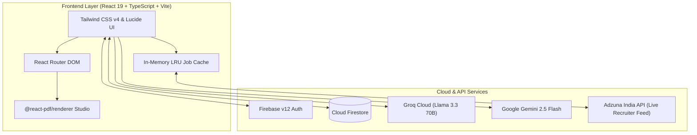

# 🎓 CareerVerse AI — Complete Project Presentation Package

---

## 📌 1. Executive Summary & Vision

**Project Title:** **CareerVerse AI** — *Next-Generation Indian Career Intelligence, Waypoint Navigation & Live Job Radar*  
**Domain:** EdTech, AI-Assisted Career Mentorship & Real-Time Employment Intelligence  
**Core Innovation:** Translates the Indian education and career lifecycle into a connected **9.5 Station Waypoint Transit System** — from 10th/12th stream selection to college entrance exams, AI skill gap benchmarking, 24/7 LLM career counseling, ATS resume building, and live recruitment feeds.

---

## 🎯 2. The Problem Statement

1. **Information Asymmetry:** Over 85% of Indian students face confusion between 10th and 12th stream choices (MPC, BiPC, Commerce, Arts, Polytechnic) and degree options.
2. **Curriculum vs. Industry Mismatch:** University curricula lag behind market demands; freshers lack visibility into actual in-demand skills and LPA salary trends.
3. **Fragmented Ecosystems:** Students must juggle multiple disjointed platforms (job boards like Naukri/LinkedIn, static roadmaps, resume builders, and assessment sites).
4. **Mock vs. Real Openings:** Most student career tools use static/outdated mock databases rather than active recruiter vacancy feeds.

---

## 💡 3. The CareerVerse AI Solution

CareerVerse AI unifies all stages into a seamless, unified single-page platform organized around **Waypoint Stations**:

```
┌─────────────────────────────────────────────────────────────────────────────┐
│                            CAREERVERSE AI HUB                               │
└──────────────────────────────────────┬──────────────────────────────────────┘
                                       │
      ┌────────────────────────────────┼────────────────────────────────┐
      │                                │                                │
┌─────▼──────────────┐       ┌─────────▼──────────┐       ┌─────────────▼──────┐
│  STATION 01 · RADAR│       │  STATION 02 · ROUTE│       │  STATION 03 · PATHS│
│  Compass & Profile │       │  10th & 12th/PUC   │       │  Degrees & Colleges│
└─────┬──────────────┘       └─────────┬──────────┘       └─────────────┬──────┘
      │                                │                                │
┌─────▼──────────────┐       ┌─────────▼──────────┐       ┌─────────────▼──────┐
│  STATION 04 · MAPS │       │  STATION 05 · ROLES│       │  STATION 06 · GAPS │
│  Dynamic Roadmaps  │       │  Role Explorer & ₹ │       │  Skill Gap & ATS   │
└─────┬──────────────┘       └─────────┬──────────┘       └─────────────┬──────┘
      │                                │                                │
┌─────▼──────────────┐       ┌─────────▼──────────┐       ┌─────────────▼──────┐
│  STATION 07 · EXAM │       │  STATION 08 · BOT  │       │  STATION 09 · RADAR│
│  AI Aptitude Test  │       │  24/7 AI Counselor │       │  Live Jobs Portal  │
└────────────────────┘       └─────────┬──────────┘       └─────────────┬──────┘
                                       │                                │
                             ┌─────────▼──────────┐           ┌─────────▼──────┐
                             │ STATION 09.5 RESUME│           │ 100% Real-Time │
                             │ ATS Studio & PDF   │           │ Adzuna India   │
                             └────────────────────┘           └────────────────┘
```

---

## 🚉 4. The Waypoint Stations Breakdown

| Station | Module Name | Key Capabilities |
| :--- | :--- | :--- |
| **01** | **Compass Dashboard** | Real-time transit line indicator, aptitude progress bar, market role cards, and 6 instant wayfinding shortcuts. |
| **02** | **Indian Education Route** | Stream decision engine for Class 10/12 (Science MPC/BiPC, Commerce, Arts, Polytechnic, Vocational, ITI). |
| **03** | **College & Degree Explorer** | Comprehensive guide to Indian entrance exams (JEE, NEET, CUET, KCET, GATE, CAT) and degrees (B.Tech, BCA, B.Sc, B.Com). |
| **04** | **Dynamic Multi-Year Roadmaps** | Semester-by-semester milestones, core technical topics, open-source project ideas, and industry certifications. |
| **05** | **Role Explorer & LPA Salaries** | 20+ in-depth profiles (AI Engineer, SDE, Cloud Architect, Data Analyst) with real-world CTC benchmarks. |
| **06** | **Skill Gap Analyzer** | Role-versus-profile comparator calculating candidate compatibility percentage and missing critical competencies. |
| **07** | **AI Technical & Aptitude Test** | Timed diagnostic exams with instant scoring, AI explanations, and personalized career track recommendations. |
| **08** | **24/7 AI Career Counselor** | Ultra-fast LLM guidance powered by **Groq Llama 3.3 70B** and **Gemini 2.5 Flash** with persistent Firestore chat memory. |
| **09** | **Live Indian Job Radar** | 100% live job search powered by the **Adzuna India API** across Bengaluru, Hyderabad, Pune, Mumbai, Delhi NCR, Chennai & Remote India, featuring smart Internship & Fresher mode and company logo domain resolution. |
| **09.5**| **ATS Resume Studio** | Single-column ATS resume generator with real-time cloud auto-sync and instant **@react-pdf/renderer** vector PDF export. |

---

## 🛠️ 5. Technical Architecture & Stack



- **Frontend:** React 19, TypeScript 5.7, Vite 6, Tailwind CSS v4, Lucide React Icons.
- **AI & NLP Inference:** Groq Cloud SDK (`llama-3.3-70b-versatile`) with Google Gemini 2.5 Flash fallback for instant responses under 500ms.
- **Backend & Cloud Database:** Firebase v12 (Authentication + Cloud Firestore for persistent profiles, resumes, and chat sessions).
- **PDF Generation:** `@react-pdf/renderer` for client-side vector PDF generation and printing.
- **External Recruitment Pipeline:** Adzuna India Developer API with dynamic proxying, 3-minute LRU memory cache, and Clearbit/Google favicon company logo resolution.

---

## 📽️ 6. Slide-by-Slide Presentation Deck

### Slide 1: Title & Introduction
- **Headline:** CareerVerse AI
- **Subtitle:** Intelligent Waypoint Career Guidance & Real-Time Job Radar for Indian Students & Freshers
- **Presented by:** [Your Name / Team Name]
- **Key Hook:** *"Transforming how Indian students transition from classroom to career with AI-driven waypoint guidance."*

### Slide 2: The Problem
- 85%+ students lack structured clarity after 10th/12th.
- Huge skill disconnect between college degrees and industry requirements.
- Job boards are cluttered with senior roles and mock postings; freshers struggle to find verified internships.

### Slide 3: The Solution — CareerVerse AI
- A unified 9.5 Station Transit System mapping every step from secondary school to live placement.
- Adaptive AI counseling and personalized skill-gap diagnostics.
- 100% live job and internship feeds tailored to Indian metro hiring hubs.

### Slide 4: System Architecture
- Clean modular SPA built on React 19 and TypeScript.
- Dual-engine AI (Groq Llama 3.3 70B + Gemini 2.5 Flash).
- Serverless Firebase Cloud Firestore integration for real-time state synchronization.

### Slide 5: The Academic & Exploration Stations (01–05)
- **Compass Dashboard:** Central command center with transit line visualizer.
- **Stream Navigator & Degrees:** Complete pathways for MPC, BiPC, Commerce, Arts, Polytechnic, and Engineering.
- **Role Explorer:** In-depth CTC salary ranges (₹6L – ₹28L+) and market growth scores.

### Slide 6: The AI Intelligence Stations (06–08)
- **Skill Gap Analyzer:** Benchmarks user skills against target roles to identify missing knowledge.
- **AI Aptitude & Testing:** Multi-dimensional aptitude scoring with AI feedback.
- **24/7 AI Counselor:** Fast conversational LLM chatbot with full context retention.

### Slide 7: The Hiring & Employment Stations (09 & 09.5)
- **Live Job Radar:** Real-time Adzuna India API stream with 1-click city filters (Bengaluru, Hyderabad, Pune, Mumbai, Delhi NCR, Chennai, Remote).
- **Smart Internship Mode:** Locks senior filters to isolate fresher/internship openings.
- **ATS Resume Studio:** Real-time editable resume editor with cloud sync and `@react-pdf/renderer` single-column ATS PDF export.

### Slide 8: Technical USPs & Performance
- **Zero Lag:** Sub-second AI inference via Groq TPU/LPU architecture.
- **Offline Resilience & Caching:** In-memory LRU job cache and Firestore offline persistence.
- **ATS Compliance:** Built strictly to single-column ATS parsing standards.

### Slide 9: Future Scope & Roadmap
- Integration with LinkedIn Easy Apply & Naukri APIs.
- AI Video Mock Interview Simulator with real-time speech and eye-contact feedback.
- Multilingual regional language support (Hindi, Telugu, Kannada, Tamil, Marathi).

### Slide 10: Conclusion & Q&A
- Summary of impact: Bringing equitable, high-tech career mentorship to every Indian student.
- Open floor for Questions & Feedback.

---

## 🎙️ 7. 3-Minute Live Demo Script

1. **Intro (0:00 - 0:30):** Open the **Dashboard**. Point out the **Signature Route Line** and the **Wayfinding Shortcuts** (Career Navigator, Role Explorer, Dynamic Roadmap, AI Counselor, Live Jobs, Resume Builder).
2. **Career Exploration (0:30 - 1:15):** Click on **Role Explorer** to show salary benchmarks (₹6L - ₹28L LPA) and required skills. Transition to **Skill Gap Analyzer** to demonstrate how missing skills are detected.
3. **AI Counselor (1:15 - 1:55):** Open **AI Counselor** (Station 08) and ask a realistic prompt: *"I am a 3rd year CSE student. Should I learn Generative AI or Full Stack for 2026 placements?"* Show the high-speed Groq Llama 3.3 response.
4. **Live Jobs & Resume (1:55 - 2:45):** Open **Live Jobs** (Station 09). Click **Bengaluru** and toggle **Internship Mode** to show real active openings. Switch to **ATS Resume Studio** (Station 09.5) to demonstrate live form editing and click **Download PDF** to show the generated ATS resume.
5. **Wrap-up (2:45 - 3:00):** Highlight the tech stack (React 19, TypeScript, Firebase, Groq, Adzuna) and invite questions.

---

## ❓ 8. Evaluator Q&A & Viva Defense Cheatsheet

### Q1: How is CareerVerse AI different from LinkedIn or Naukri?
> **Answer:** LinkedIn and Naukri are recruitment boards meant for active job listings, primarily targeted at experienced professionals without structured educational guidance. CareerVerse AI is an end-to-end guidance platform that begins at 10th/12th grade, maps university semesters, provides AI assessments, diagnoses skill gaps, builds ATS resumes, and provides fresher-filtered live job openings.

### Q2: How does the Live Job Radar fetch real data?
> **Answer:** It integrates directly with the **Adzuna Developer API (India Region `in`)**. Every search executes a live query with query parameters for location, category, and salary. It includes an in-memory 3-minute LRU cache to reduce API calls and provide instant tab switching.

### Q3: Why did you use Groq Llama 3.3 70B alongside Google Gemini?
> **Answer:** Groq's LPU hardware delivers ultra-low latency (<500ms) for real-time chat experiences, making the AI Counselor feel conversational and instant. Gemini serves as a fallback engine and handles structured role profile generation.

### Q4: How does the Resume Builder guarantee ATS friendliness?
> **Answer:** It uses a single-column, standard semantic hierarchy without tables, multiple columns, or embedded graphics that confuse ATS parsers. Resumes are rendered with `@react-pdf/renderer` using standard vector fonts (Helvetica) and standard section headers.
